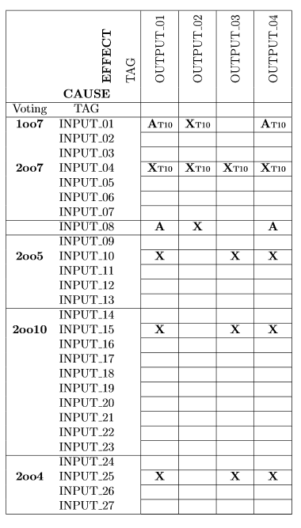

A PLC emulator with an OPCUA server for tests

# Description

This program emulates a simple PLC for testing purposes. It has a built-in  OPCUA webserver to communicate with other devices. Figure 1 illustrates the logic supported by the emulator. The list of TAGs is available at 'plc_emulator/opc_variables.csv'.



# Dependency

This project requires the following packages to work:

* Asyncua-OPCUA: https://github.com/FreeOpcUa/opcua-asyncio


# Usage

Please, follow the procedures below to execute the plc emulator:

1. To start the plc emulator:
```
python main.py
```

2. To list all available options:

```
python main.py -h
```


